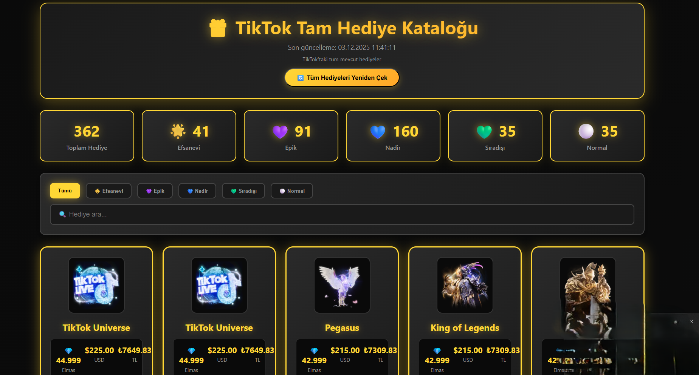
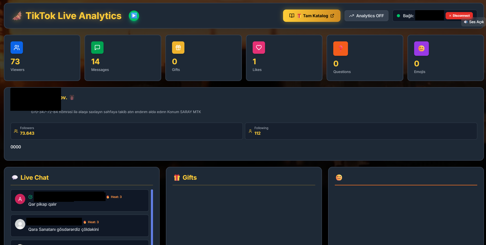
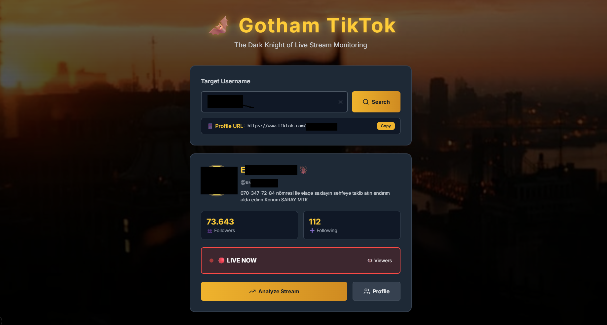
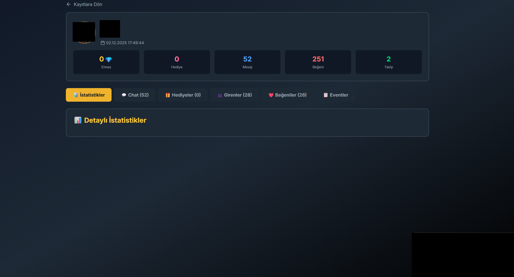
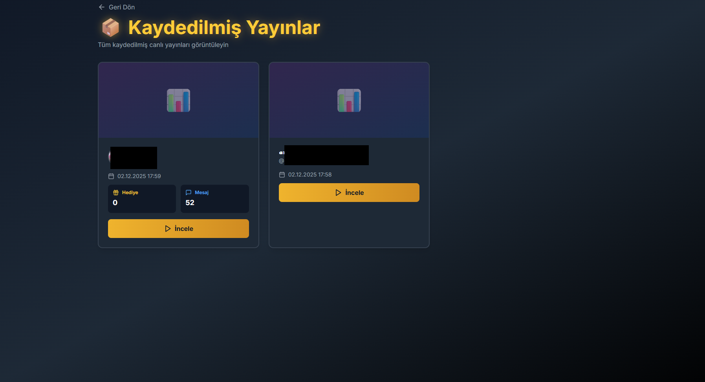
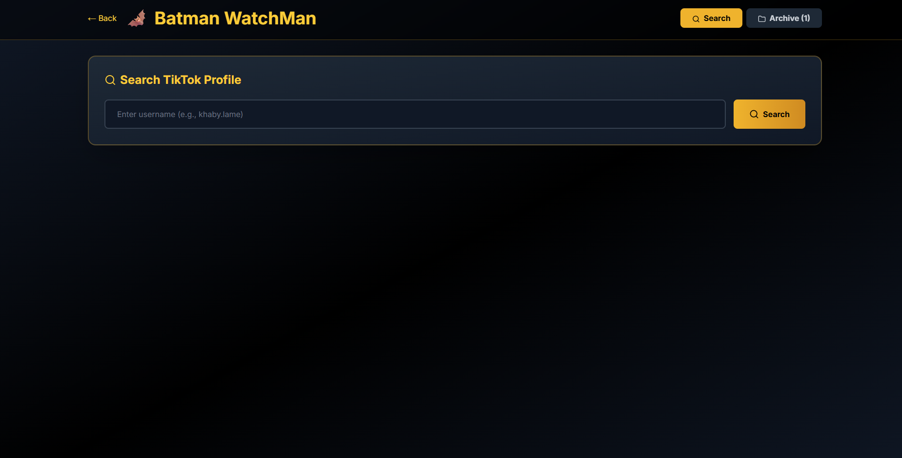
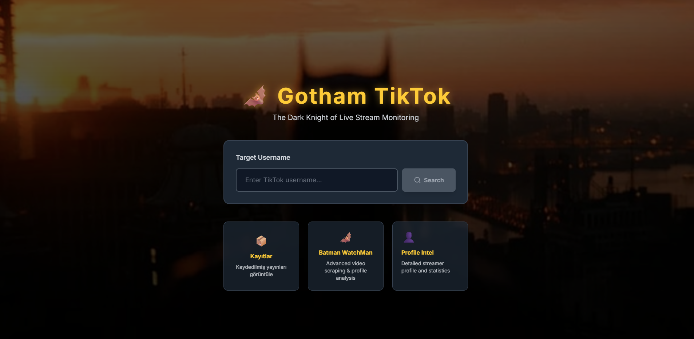

# 🎬 TikTok Live Analytics & Video Scraper

TikTok canlı yayın analitikleri, video indirme ve profil analizi için geliştirilmiş kapsamlı bir Node.js projesi.

## ⚠️ ÖNEMLİ UYARI

**Uygulama geliştirilme halinde, stabil olmayabilir. Bazı özellikler Python versiyonu daha stabil ama kısıtlı.**

## 📸 Ekran Görüntüleri

<div align="center">
  
  
  
  
  
  
  
</div>

## 📋 İçindekiler

- [Özellikler](#-özellikler)
- [Önemli Notlar](#-önemli-notlar)
- [Gereksinimler](#-gereksinimler)
- [Kurulum](#-kurulum)
- [Kullanılan Kütüphaneler](#-kullanılan-kütüphaneler)
- [Kullanım](#-kullanım)
- [API Endpoints](#-api-endpoints)
- [Sorun Giderme](#-sorun-giderme)

## ✨ Özellikler

- 🔴 **Canlı Yayın Analitikleri**: TikTok canlı yayınlarını izleme ve analiz etme
- 📊 **Gerçek Zamanlı İstatistikler**: İzleyici sayısı, beğeni, yorum, hediye takibi
- 🎁 **Hediye Kataloğu**: Tüm TikTok hediyelerini listeleme ve analiz etme
- 📹 **Video İndirme**: TikTok videolarını ve yorumlarını toplu indirme
- 👤 **Profil Analizi**: Detaylı kullanıcı profil bilgileri çekme
- 💾 **Kayıt Sistemi**: Yayınları kaydetme ve arşivleme
- 🎨 **Modern Dashboard**: Next.js ile geliştirilmiş kullanıcı dostu arayüz

## ⚠️ ÖNEMLİ NOTLAR

### 🔐 TikTok Signature Kütüphanesi (ZORUNLU)

**Bu proje TikTok Signature kütüphanesi olmadan çalışmaz!**

TikTok Signature servisi, TikTok API istekleri için gerekli imzaları (X-Gorgon, X-Ladon) oluşturur. Bu servis olmadan video indirme ve profil analizi özellikleri çalışmaz.

**Kurulum:**
```bash
cd backend/tiktok-signature
npm install
npm start
```

Bu servis **port 8100**'de çalışmalıdır. Backend servisi bu porttan signature alır.

### 🍪 Cookie Gereksinimi

Video indirme ve profil analizi özellikleri için TikTok cookie'si gereklidir. Cookie olmadan bu özellikler çalışmaz.

## 📦 Gereksinimler

- **Node.js** v16 veya üzeri
- **npm** veya **yarn**
- **FFmpeg** (video kayıt ve dönüştürme için)
- **Python** (TikTok Signature servisi için - opsiyonel, Node.js versiyonu kullanılabilir)

## 🚀 Kurulum

### 1. Projeyi Klonlayın

```bash
git clone <repository-url>
cd tikitok
```

### 2. Backend Kurulumu

```bash
cd backend
npm install
```

### 3. TikTok Signature Servisini Başlatın (ZORUNLU)

```bash
cd tiktok-signature
npm install
npm start
```

Bu servis **http://localhost:8100** adresinde çalışmalıdır.

### 4. Environment Variables Ayarlayın

`backend` klasöründe `.env` dosyası oluşturun:

```env
TIKTOK_USER_COOKIE="cookie_değeriniz_buraya"
```

**Cookie Nasıl Alınır:**
1. Tarayıcınızda TikTok web sitesine gidin ve giriş yapın
2. F12 tuşuna basarak Developer Tools'u açın
3. Network sekmesine gidin
4. TikTok'ta herhangi bir sayfaya gidin
5. İsteklerden birini seçin
6. Request Headers bölümünden `Cookie` değerini kopyalayın
7. `.env` dosyasına yapıştırın

### 5. Frontend Kurulumu (Dashboard)

```bash
cd tiktok-dashboard
npm install
npm run dev
```

Dashboard **http://localhost:3000** adresinde çalışacaktır.

### 6. Backend Servisini Başlatın

```bash
cd backend
npm start
```

Backend servisi:
- **HTTP API**: http://localhost:3001
- **WebSocket**: ws://localhost:8080

## 📚 Kullanılan Kütüphaneler

### Backend Ana Kütüphaneler

- **express** (^5.1.0) - HTTP sunucu framework'ü
- **ws** (WebSocket) - Gerçek zamanlı iletişim
- **tiktok-live-connector** (^2.1.0) - TikTok canlı yayın bağlantısı
- **axios** (^1.12.2) - HTTP istekleri
- **cheerio** (^1.1.2) - HTML parsing
- **cors** (^2.8.5) - Cross-origin resource sharing
- **fs-extra** (^11.3.2) - Gelişmiş dosya işlemleri
- **socket.io** (^4.8.1) - WebSocket iletişimi
- **playwright** (^1.56.1) - Browser otomasyonu
- **puppeteer** (^24.26.1) - Browser otomasyonu

### TikTok Signature Kütüphanesi (ZORUNLU)

- **tiktok-signature** (^3.0.0) - TikTok API imza üretici
- **playwright** (^1.41.2) - Browser context için
- **protobufjs** (^7.5.4) - Protobuf desteği

### Frontend Kütüphaneler

- **next** (^15.5.6) - React framework
- **react** (^19.2.0) - UI kütüphanesi
- **framer-motion** (^11.18.2) - Animasyonlar
- **lucide-react** (^0.400.0) - İkonlar
- **tailwindcss** (^3.4.18) - CSS framework
- **ws** (^8.18.3) - WebSocket client

## 🎯 Kullanım

### Backend Servislerini Başlatma

1. **TikTok Signature Servisi** (ZORUNLU):
   ```bash
   cd backend/tiktok-signature
   npm start
   ```

2. **Ana Backend Servisi**:
   ```bash
   cd backend
   npm start
   ```

3. **Frontend Dashboard** (Opsiyonel):
   ```bash
   cd tiktok-dashboard
   npm run dev
   ```

### Canlı Yayın İzleme

1. Dashboard'u açın: http://localhost:3000
2. TikTok kullanıcı adını girin
3. "Bağlan" butonuna tıklayın
4. Canlı istatistikleri izleyin

### Video İndirme

Video indirme özelliği için:
- TikTok Signature servisi çalışıyor olmalı (port 8100)
- `.env` dosyasında `TIKTOK_USER_COOKIE` tanımlı olmalı

API endpoint'i:
```
POST http://localhost:3001/scrape-videos
```

## 🔌 API Endpoints

### HTTP API (Port 3001)

- `GET /check-user?username=xxx` - Kullanıcı kontrolü
- `GET /get-advanced-profile?username=xxx` - Detaylı profil bilgisi
- `POST /scrape-videos` - Video indirme başlat
- `GET /scrape-progress/:username` - İndirme ilerlemesi
- `GET /scraped-users` - İndirilen kullanıcılar listesi
- `GET /user-videos` - Kullanıcı videoları
- `GET /list-recordings` - Kayıtlar listesi
- `GET /get-recording/:username/:streamId` - Kayıt detayı
- `POST /convert-to-mp4/:username/:streamId` - Video dönüştürme

### WebSocket (Port 8080)

- `connect` - Yayına bağlan
- `disconnect` - Bağlantıyı kes
- `getStats` - İstatistikleri al
- `getStreamerProfile` - Yayıncı profili
- `toggleRecording` - Video kaydı başlat/durdur

## 🔧 Sorun Giderme

### TikTok Signature Servisi Çalışmıyor

**Hata:** "X-Gorgon verisi Python sunucusundan alınamadı"

**Çözüm:**
1. TikTok Signature servisinin çalıştığından emin olun:
   ```bash
   cd backend/tiktok-signature
   npm start
   ```
2. Port 8100'in açık olduğunu kontrol edin
3. `backend/modules/videoyorum.js` dosyasındaki `PYTHON_BASE_URL` değerini kontrol edin

### Cookie Hatası

**Hata:** "TIKTOK_USER_COOKIE environment variable tanımlı değil"

**Çözüm:**
1. `backend` klasöründe `.env` dosyası oluşturun
2. Cookie'yi doğru şekilde ekleyin
3. Backend servisini yeniden başlatın

### Video İndirme Çalışmıyor

**Kontrol Listesi:**
- ✅ TikTok Signature servisi çalışıyor mu? (port 8100)
- ✅ `.env` dosyasında cookie tanımlı mı?
- ✅ Cookie geçerli mi? (TikTok'ta giriş yapılmış olmalı)

### Port Çakışması

Eğer portlar kullanılıyorsa, şu dosyalarda değiştirebilirsiniz:

- **Backend HTTP**: `backend/server.js` → `HTTP_PORT`
- **Backend WebSocket**: `backend/server.js` → `WS_PORT`
- **TikTok Signature**: `backend/tiktok-signature/src/config.js` → `PORT`

## 📝 Notlar

- TikTok Signature servisi **olmadan** video indirme ve profil analizi çalışmaz
- Cookie'ler kişisel bilgiler içerir, asla GitHub'a yüklemeyin
- `.env` dosyası `.gitignore`'da zaten tanımlı
- FFmpeg yüklü değilse video kayıt özelliği çalışmaz

## 📄 Lisans

ISC

## 🤝 Katkıda Bulunma

Pull request'ler kabul edilir. Büyük değişiklikler için önce bir issue açarak neyi değiştirmek istediğinizi tartışın.

## ⚠️ Uyarı

Bu proje eğitim amaçlıdır. TikTok'un kullanım şartlarına uygun kullanın. TikTok'un API'sini kötüye kullanmayın.


